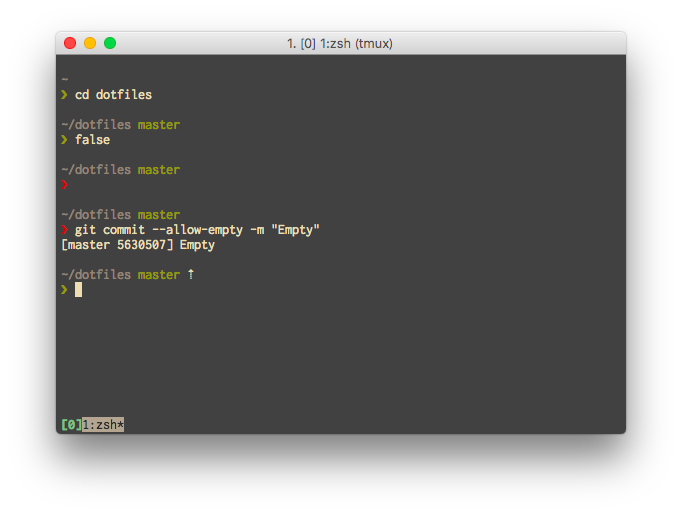

Inspired by [sindresorhus/pure](https://github.com/sindresorhus/pure) and [S1cK94/minimal](https://github.com/S1cK94/minimal)

Note: iTerm2's Colorscheme is [gruvbox](https://github.com/morhetz/gruvbox-contrib) 
